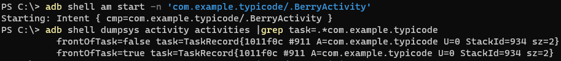
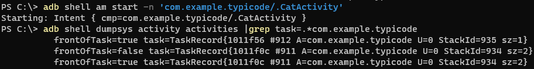
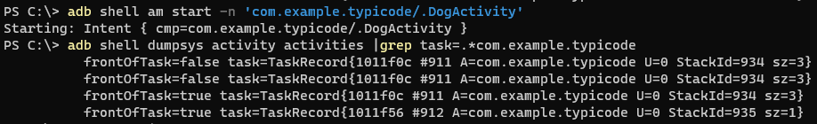
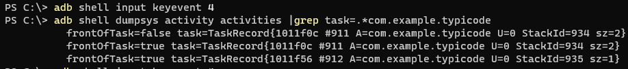
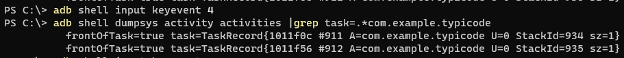
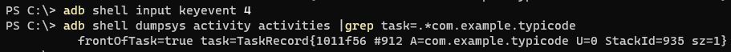

Android launchMode SingleInstance behavior
==========================================

Android activity launch mode `singleInstance` always create a new task.
Here we analyze the task and stack behavior for activities with `singleInstance`
launch mode.

System create a task `Task_main` when launch app, this task contains one
activity now.

* `Task_main(AppleActivity)` - foreground

Then we launch the second activity call `BerryActivity`, this activity will
push into `Task_main`. Now task `Task_main` contains two activities.

* `Task_main(AppleActivity/BerryActivity)` - foreground

> 

After then, we launch the third activity call `CatActivity` with launch mode  
`singleInstance`. The system will create a new task `Task_C`. Now, there are  
two tasks related with our app, `Task_main` and `Task_C`. `Task_C` is in
foreground and `Task_main` is in background.

* `Task_main(AppleActivity/BerryActivity)` - background
* `Task_C(CatActivity)` - foreground

> 

Then, we launch the fourth activity call `DogActivity` with default launch mode.
The system will place this activity into `Task_main`. And `Task_main` will be the
foreground one task, `Task_C` is in background.

* `Task_main(AppleActivity/BerryActivity/DogActivity)` - foreground
* `Task_C(CatActivity)` - background

> 

We start navigate with back key from now.

Since `Task_main` is in foreground now, all activities in this task should pop up
firstly. After the first back key, we have the following app task.

* `Task_main(AppleActivity/BerryActivity)` - foreground
* `Task_C(CatActivity)` - background

> 

After the second back key, we have the following app task.

* `Task_main(AppleActivity)` - foreground
* `Task_C(CatActivity)` - background

> 

After the third back key, `Task_main` will be destroy, since all of activities it holds
are destroyed. `Task_C` will be the foreground one.

* `Task_C(CatActivity)` - background

> 

