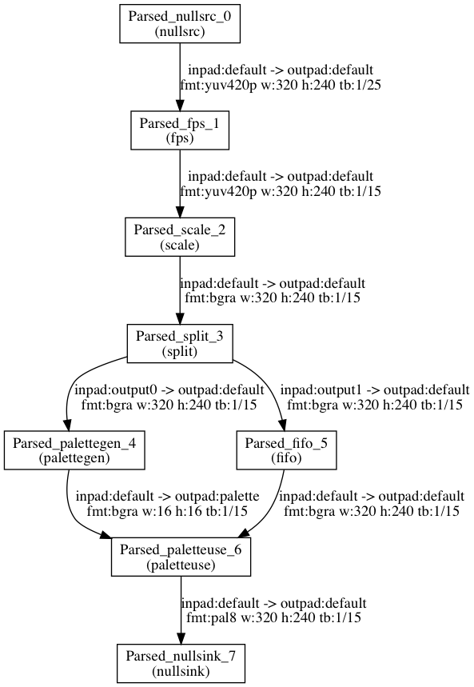

Generate optimized GIF with FFmpeg palette filter
======

With the help of `palettegen` and `paletteuse` filter, it's easy to turn a video to an animated gif.

Let's see a filter chain use default paramters.

```bash
$ ffmpeg -i input.mp4 -vf \
    'fps=15,scale=320:-1:flags=lanczos,split [o1] [o2];[o1] palettegen [p];[o2] fifo [o];[o] [p] paletteuse' \
    -loop 0 output.gif
```

Or use `graph2dot` to generate a graph and graphically showed as below

```bash
$ make tools/graph2dot
$ echo 'nullsrc,fps=15,scale=320:-1:flags=lanczos,split [o1] [o2];[o1] palettegen [p];[o2] fifo [o];[o] [p] paletteuse,nullsink' \
    | tools/graph2dot -o - | sed '/rankdir/s/LR/TB/' \
    | dot -Tpng -o filter_graph_palette.png
```

In order to use the command above, your system must have [graphviz](http://www.graphviz.org/) installed. Also I change the output
graph rank direction from `left/right` to `top/bottom` by replacing `LR` with `TB`.



If we use command above, we can turn a video with 2MB size and get a 6.2MB gif output. By specifying some parameters, we can have
a slight improvement for the size of resulting file.

```bash
$ ffmpeg -i input.mp4 -vf \
    'fps=15,scale=320:-1:flags=lanczos,split [o1] [o2];[o1] palettegen=stats_mode=diff [p];[o2] fifo [o];[o] [p] paletteuse=dither=bayer:bayer_scale=5:diff_mode=rectangle' \
    -loop 0 output.gif
```

#### comparison of result file size

| video size | default paramters | non-default paramters
|------------|-------------------|-----------------------
|  2.0MB     |    6.2MB          |    4.2MB

If the result file size still can not meet your requirement, extra steps can take to reduce the output file size

1. use a smaller `fps`
2. use `gifsicle` to reduce color index or perform other optimize

Reference
------
* [Optimizing GIFS with FFMPEG](https://cassidy.codes/blog/2017/04/25/ffmpeg-frames-to-gif-optimization/)
* [Optimize animated GIF size in command-line](https://superuser.com/questions/1107200/optimize-animated-gif-size-in-command-line)
* [How do I convert a video to GIF using ffmpeg, with reasonable quality?](https://superuser.com/questions/556029/how-do-i-convert-a-video-to-gif-using-ffmpeg-with-reasonable-quality)
* [gifsicle](https://github.com/kohler/gifsicle)
